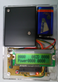
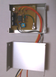
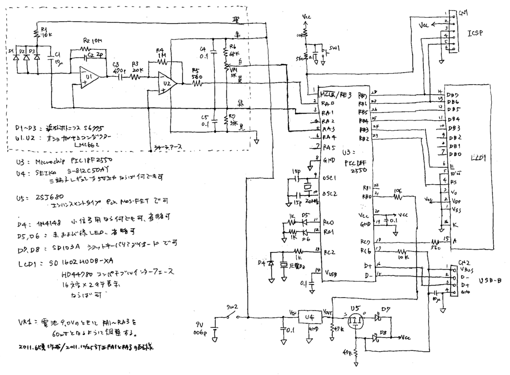

# Portable dosimeter ポータブル線量計
## Radiation counter using PIN photodiode 放射線測定器PINフォトダイオード使用
The original was created at the time of the Great East Japan Earthquake in 2011. The key point of this instrument is that it is calibrated with a standard source and dose estimation is possible.  
オリジナルは2011年の東日本大震災の時に作成しました。この機器のポイントは、標準線源で校正されていて、線量の見積もりか可能なことです。 
 
Overall view. Detector is PIN photodiode S6775. The upper left box is for electrical shielding and contains the PIN photodiode. Gamma rays can be detected throught the shielding case. If you would like to detect X-rays below 50 keV or beta rays, please drill a hole in the case and cover it with black paper or aluminum foil. To reduce noise, a 9 V battery in the upper right corner is as the power source. Counting are done by the PIC microcontroller in the lower half. The LCD display is from the prototype and is different from that of the dosimeter. The overall size is approximately 115 x 80 x 25 mm. 
全体像です。検出はPINフォトダイオードS6775で行います。左上の黒いボックスがPINフォトダイオードが入っている部分です。電気的なシールドのためにアルミケースにその部分をおさめています。ガンマ線が測定対象で、ケースに窓はあけていません。ケースに穴を開けて黒い紙やアルミホイルを貼れば）50 keV以下のX線やベータ線も検出できます。ノイズを減らすには、電源を電池にするのが簡単かつ有効で、右上の9 V電池を使っています。計数や換算は下半分のPICマイコンで行います。液晶表示は試作時のもので、線量計とは違っています。全体の大きさはおよそ縦115 mm、横80 mm、厚25 mmで、秋月のプラケース112-TSに入れています。 
 
The detector case. Three PIN photodiodes S6775 are lined up on the left. They are covered with heat-shrinkable tubing for shading, but black vinyl tape or similar would be fine. Since we are dealing with very small signals, the detector part must be electrically shielded. We used an aluminum case with its sheet thickness of 1 mm. The target of measurement is gamma rays from 0.5 MeV to 1.5 MeV. Gamma rays of 662 keV for cesium 137 and 605 keV and 796 keV for cesium 134 can be measured. In this photo taken during production, only five cables are shown, but then a zero-potential cable is also added for a total of six cables. The board is screwed in with 5 mm spacers and grounded to the aluminum chassis. 
検出器を開けたところです。左に３つ並んでいるのがPINフォトダイオードのS6775です。遮光のために熱収縮チューブをかぶせていますが、黒ビニールテープなどでもいいと思います。ごく小さい信号を扱いますので、検出器部分は電気的にシールドすることが必要になります。用いたのはYM-65（タカチ電機工業）で、アルミ板厚が1 mmです。測定対象は0.5 MeV～1.5 MeVのガンマ線です。セシウム137のガンマ線662 keV、セシウム134の605 keVや796 keVが測れます。製作中の写真で、ケーブルは赤・橙・黄・白・黒の５本しか出ていませんが、その後、ゼロ電位の緑も加えて計６本を出しています。基板は5 mmのスペーサを入れてネジ止めし、シャーシにアースをとっています。 

##Schematic 回路図
 
検出器部分は浜松ホトニクスさんの応用回路例を参考にしたものです。PINフォトダイオードは検出面積をかせぐため、３つ並列にしています。初段のU1により放射線が電圧パルスに変換され、U2の反転増幅で50倍されます。周波数特性は、上はオペアンプの特性で決まり（LMC662のデータシートを参照）、下はC3で20 kHz程度から下がります。出力は、数十～百 mV超で20～50 μ秒のパルスが出ているようです。それがVR1で設定するしきい値（50～60 mV）を超えた時にPICに割り込みがかかり、AD変換して電圧を記録します。左上の点線部分をアルミケースにおさめます。VR1をケース内にしてしまうと調整が面倒なのですが、ノイズ対策です。PICマイコン周辺や液晶への接続、USBコネクタの接続はごく標準的です。下のMOS FET周辺は、USBバスパワーが供給されたときに電池を節約するための部分です。必要なければ、U4のVoutをVccにつなぎ、U5, D7, D8, CN2, 10 μF, 47 kΩ x2, 10 kΩ x2を省略して構いません。RC0～RC2の回路も好みで省略できます。 
The detector part is based on Hamamatsu Photonics' application circuit example. 3 PIN photodiodes are used in parallel to increase the detection area. The radiation is converted into a voltage pulse by U1 and multiplied by 50 times by inverting amplification in U2. The frequency response is determined by the characteristics of the op amp at the top (see LMC662 datasheet) and at the bottom by C3 (~ 20 kHz). The output seems to be a pulse of 20 to 50 μsec at tens to over a hundred mV. When it exceeds the threshold (50-60 mV) set by VR1, the PIC is interrupted, converted to AD, and the voltage is recorded. The dotted line part in the upper left corner is placed in an aluminum case to minimize noise, though it is troublesome to adjust VR1 inside the case. The circuit around the PIC microcontroller, LCD, and USB connector are very standard. The area around the MOS FET below is for saving battery power when USB bus power is supplied. If not necessary, connect Vout of U4 to Vcc and omit U5, D7, D8, CN2, 10 μF, 47 kΩ x2, and 10 kΩ x2. You can also omit circuits of RC0-RC2. 
  
